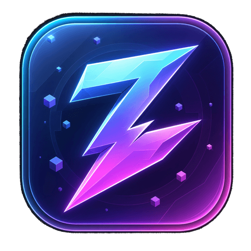

<div align="center">



# ⚡ Zeko Launcher

### Giao diện đẹp · Turbo FPS cho máy yếu · Sentinel bảo vệ tệp game

**Bản 1.0 "Aurora"** — launcher Minecraft mã nguồn mở, chạy ngay bằng `node server/index.js`,
không cần build, không cần toolchain Qt/CMake.

[Chạy thử](#-chạy-trong-30-giây) · [Tính năng](#-tính-năng) · [Kiến trúc](docs/ARCHITECTURE.md) · [Hiệu năng](docs/PERFORMANCE.md) · [Bảo mật](docs/SECURITY.md)

</div>

---

## 🎬 Nó trông như thế nào

Zeko Launcher có **8 màn hình**: Bảng điều khiển · Instance · Zeko Turbo · Zeko Sentinel ·
Console · Tải xuống · Cài đặt · Giới thiệu.

- Nền kính mờ (glassmorphism) + nền hạt canvas, **tắt được bằng một nút** để nhường tài nguyên cho game.
- **6 chủ đề màu** (Violet, Emerald, Sunset, Ocean, Cyberpunk, Mono), đổi tức thời, không tải lại trang.
- Bố cục co giãn từ điện thoại (menu trượt) tới màn hình rộng; tôn trọng `prefers-reduced-motion`.
- Tiếng Việt mặc định, chuyển English bằng một nút.
- Không framework, không bundler: toàn bộ UI là HTML/CSS/ES-module thuần → tải trong tích tắc trên máy yếu.

---

## ✨ Tính năng

### 🧊 Instance — hồ sơ chơi độc lập
Tạo instance với phiên bản Minecraft, mod loader (Vanilla/Fabric/Quilt/Forge/NeoForge),
biểu tượng, nhóm, RAM riêng, kích thước cửa sổ và hồ sơ hiệu năng riêng.
Mỗi instance có thư mục riêng (`mods/ resourcepacks/ shaderpacks/ config/ saves/`)
nhưng **dùng chung** `libraries/ assets/ versions/` → cài 5 instance cùng phiên bản chỉ tốn một lần dung lượng.
Nhân bản, sửa, xoá, duyệt tệp, thống kê dung lượng và thời gian chơi.

### ⚡ Zeko Turbo — tối ưu FPS thật, không phải nút "Boost"
- **4 hồ sơ hiệu năng**: 🥔 Máy cực yếu · ⚡ Máy yếu · 🎯 Cân bằng · 🚀 Zeko Ultra.
  Mỗi hồ sơ là bộ ba: **JVM args** (Aikar-style G1 / SerialGC / ZGC) + **ghi sẵn `options.txt`**
  (render distance, particles, mây, bóng entity, biome blend, VSync…) + **danh sách mod tăng FPS**.
- **Điểm chuẩn ZPI 0–1000** đo CPU (sàng nguyên tố), đĩa (ghi 8 MB), RAM vật lý và áp lực GC
  trong **dưới 400 ms** → tự đề xuất hồ sơ đúng với phần cứng của bạn thay vì để bạn đoán.
- **Auto-Tune** theo dõi CPU/RAM/load mỗi 2 giây và cảnh báo khi máy đang quá tải.
- Danh mục **18 mod tăng FPS** có mô tả, mức tác động và nền tảng hỗ trợ;
  5 gói shader phân theo sức máy; hướng dẫn tinh chỉnh Windows/Linux/macOS.
- Tự động chọn **đúng bản Java** cho từng phiên bản (Java 8 / 17 / 21) và dò JVM
  trên PATH, thư mục Adoptium/Microsoft/Zulu/Liberica, `JAVA_HOME` và runtime do Zeko quản lý.

### 🛡️ Zeko Sentinel — an toàn tệp game, ba lớp
1. **VERIFY** — so SHA-1 của `client.jar` và mọi thư viện với manifest chính thức của Mojang.
   Tải tệp cũng băm SHA-1 ngay trong lúc ghi và **huỷ tải** nếu không khớp.
2. **HEURISTIC** — đọc thẳng cấu trúc JAR/ZIP (EOCD, ZIP64, central directory, `inflateRawSync`)
   **mà không giải nén ra đĩa**: phát hiện `.exe/.bat/.ps1/.vbs` trong resource pack,
   magic bytes `MZ`/`ELF`, entropy Shannon > 7,9 (payload bị đóng gói),
   JAR thiếu `fabric.mod.json`/`mods.toml`, class bị làm rối tên, URL ngoài hệ sinh thái Minecraft.
3. **SIGNATURE** — 15 chữ ký cho các họ mã độc Minecraft đã công bố công khai:
   đọc `lastlogin`/`launcher_accounts.json`, đánh cắp token Discord + webhook,
   `powershell -EncodedCommand`, autorun, ghi đè runtime Java, `URLClassLoader`/`ProcessBuilder`…

Kết quả là **điểm rủi ro 0–100 kèm lý do cụ thể**, không phải kết luận nhị phân.
Tệp nghi ngờ được chuyển vào **vùng cách ly** và **khôi phục 1-chạm** — Zeko không bao giờ xoá tệp của bạn.
Có thêm **ảnh gốc SHA-1** (integrity baseline) để phát hiện tệp bị sửa giữa các lần chơi.
Có thể **chặn khởi động** nếu phát hiện rủi ro cao.

> ⚠️ Sentinel bảo vệ **thư mục game**, không diệt virus toàn hệ thống và
> **không thay thế** Windows Defender. Đọc [`docs/SECURITY.md`](docs/SECURITY.md) — tài liệu đó
> nói rõ giới hạn thật sự và cách xử lý báo động giả.

### 🖥️ Console & tải xuống thời gian thực
Luồng **SSE** đẩy log game, tiến độ tải và số liệu CPU/RAM lên UI.
Console có bộ lọc, chép toàn bộ, đọc `latest.log` cũ và tách riêng dòng FPS.
Màn hình tải xuống hiện hàng đợi từng tệp kèm SHA-1 đã xác minh.

---

## 🚀 Chạy trong 30 giây

Yêu cầu: **Node.js 18+** (khuyên dùng 20/22). Không cần gì khác.

```bash
git clone https://github.com/tiensdattnek-ai/ZekoLauncher.git
cd ZekoLauncher
npm install
npm start          # → http://localhost:4179
```

Hoặc dùng script:

```bash
./scripts/run.sh       # Linux / macOS
scripts\run.bat        # Windows (tự cài phụ thuộc và mở trình duyệt)
```

Biến môi trường:

| Biến | Mặc định | Ý nghĩa |
|---|---|---|
| `ZEKO_PORT` | `4179` | Cổng HTTP |
| `ZEKO_HOST` | `0.0.0.0` | Interface lắng nghe |
| `ZEKO_ROOT` | theo OS | Thư mục dữ liệu (instance, thư viện, cách ly) |
| `ZEKO_DOWNLOAD_CONCURRENCY` | `4` | Số tệp tải song song — hạ còn 2 cho mạng yếu |

Dữ liệu được lưu tại:

| OS | Đường dẫn |
|---|---|
| Windows | `%APPDATA%\ZekoLauncher` |
| macOS | `~/Library/Application Support/ZekoLauncher` |
| Linux | `~/.local/share/zekolauncher` |

---

## 🧪 Tự kiểm thử Sentinel (an toàn, không cần mã độc thật)

Trong **Zeko Sentinel** hoặc trang chi tiết instance có nút **"Tạo tệp mẫu kiểm thử"**.
Nó sinh ba tệp giả lập bằng bộ ghi ZIP tối giản (`server/lib/zipwrite.js`):

| Mẫu | Kết quả mong đợi |
|---|---|
| `CleanSamplePack.zip` | `clean`, điểm ~0 |
| `DarkSamplePack.zip` (có `install.bat` + PowerShell mã hoá) | `threat` ~95 → cách ly |
| `freecoins-mod.jar` (không metadata, class rối tên, `MZ`, Discord webhook, IP trần) | `threat` ~100 → cách ly |

Từ terminal:

```bash
node scripts/zeko-scan.js <thư-mục-instance>              # báo cáo cho người đọc
node scripts/zeko-scan.js <thư-mục-instance> --json       # cho script/CI (exit 1 nếu có threat)
node scripts/zeko-scan.js <thư-mục-instance> --quarantine # quét và cách ly luôn
npm test                                                  # bộ kiểm thử lõi
```

---

## 🗂️ Cấu trúc kho

```
ZekoLauncher/
├─ server/                 lõi Node.js — không cần build
│  ├─ index.js             Express + SSE hub
│  ├─ routes/api.js        ~40 endpoint REST
│  ├─ lib/                 ★ toàn bộ logic nghiệp vụ (không phụ thuộc HTTP)
│  │   scanner.js  launcher.js  performance.js  downloads.js  zip.js
│  │   quarantine.js  instances.js  catalog.js  java.js  metrics.js  settings.js
│  └─ data/                versions.json · performance-presets.json · scanner-rules.json
├─ client/                 UI thuần HTML/CSS/ES-module
│  ├─ index.html  css/main.css  assets/
│  └─ js/  main.js api.js ui.js i18n.js + views/ (8 màn hình)
├─ scripts/                run.sh · run.bat · zeko-scan.js
├─ docs/                   ARCHITECTURE.md · PERFORMANCE.md · SECURITY.md
└─ package.json
```

API chính: `GET /api/meta` · `GET/POST /api/instances` · `GET /api/performance/presets`
· `GET /api/performance/recommend` · `POST /api/system/benchmark` · `POST /api/security/scan`
· `POST /api/launch/:id` · `GET /api/stream` (SSE). Danh sách đầy đủ trong
[`docs/ARCHITECTURE.md`](docs/ARCHITECTURE.md#6-api-tóm-tắt).

---

## ⚠️ Trạng thái & giới hạn trung thực

**Đã hoạt động thật:** quản lý instance trên đĩa, danh mục phiên bản (offline-first),
Sentinel 3 lớp + cách ly + khôi phục + ảnh gốc SHA-1, điểm chuẩn máy và đề xuất hồ sơ,
dựng lệnh khởi động đầy đủ (JVM args, classpath, natives, assets, token ngoại tuyến),
stream log/tải/metrics qua SSE, 6 chủ đề, i18n, CLI quét.

**Cần môi trường thật:** chạy game cần **Java** được cài trên máy và **mạng** tới
`piston-meta.mojang.com` để tải client.jar/thư viện. Nếu thiếu, Zeko không im lặng thất bại —
nó trả về đúng lệnh đã dựng kèm giải thích từng vấn đề.

**Chưa có (nằm trong lộ trình 1.1–1.2):** đăng nhập Microsoft (hiện là chế độ ngoại tuyến),
tự cài Fabric/Forge/NeoForge, tải mod trực tiếp từ Modrinth/CurseForge, nhập modpack,
bản desktop đóng gói (Tauri/Electron). Chi tiết: [Architecture §8](docs/ARCHITECTURE.md#8-đường-nâng-cấp-lên-bản-desktop-cao-cấp-nhất).

---

## 🗺️ Lộ trình

- **1.0 Aurora** ✅ — giao diện, Turbo, Sentinel, instance, console SSE, điểm chuẩn, cách ly, i18n
- **1.1** — OAuth Microsoft, tải mod Modrinth/CurseForge, cài mod loader tự động, nhập `.mrpack`
- **1.2** — đa phiên bản song song, biểu đồ 1%-low, hồ sơ shader, đồng bộ đám mây
- **2.0** — bản desktop Tauri/Electron, lõi native C++/Qt cho Sentinel & downloader, delta update,
  kênh chữ ký cộng đồng có ký ed25519

---

## ⚖️ Giấy phép & ghi nhận

**GPL-3.0-or-later.**

Kiến trúc instance, cách tổ chức `libraries/assets/versions`, cách dựng classpath và chọn Java
theo phiên bản được lấy cảm hứng từ **[PrismLauncher](https://github.com/PrismLauncher/PrismLauncher)**
(GPL-3.0), kế thừa MultiMC và PolyMC. Cảm ơn cộng đồng launcher Minecraft mã nguồn mở.
Bộ tham số G1 dựa trên Aikar's flags đã được cộng đồng kiểm chứng rộng rãi.

*Minecraft là thương hiệu của Mojang Studios / Microsoft. Dự án này không liên kết
và không được Mojang hay Microsoft bảo trợ.*
